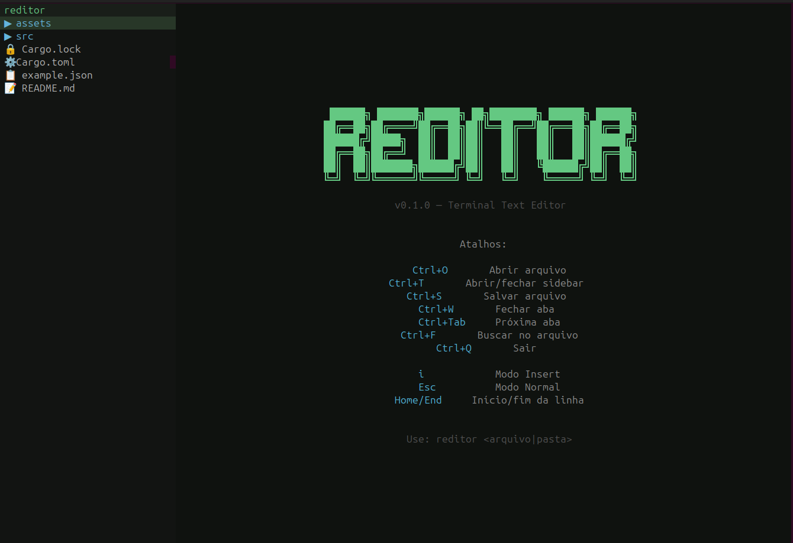

# Reditor 🦀

Um editor de texto simples para terminal, escrito em Rust.



## ✨ Funcionalidades

### 🎨 Syntax Highlighting
- Suporte para **15+ linguagens** incluindo Rust, JavaScript/TypeScript, Python, C/C++, Go, Java, SQL, HTML/CSS e mais
- Coloração de sintaxe com tokens:
  - **Keywords** (roxo): `fn`, `let`, `mut`, `if`, `else`, etc.
  - **Strings** (verde): texto entre aspas
  - **Comentários** (cinza): comentários de linha e bloco
  - **Números** (laranja): literais numéricos
  - **Tipos** (amarelo): tipos de dados
  - **Funções** (azul): chamadas de função
  - **Operadores** (ciano): operadores aritméticos e lógicos
  - **Macros** (ciano): macros Rust (`println!`, etc.)
  - **Lifetimes** (laranja): lifetimes Rust (`'a`, `'static`)
- Suporte para comentários multi-linha com rastreamento de estado entre linhas

### 📂 Navegação Lateral de Arquivos
- Árvore de arquivos com expansão/colapso de diretórios (`▼`/`▶`)
- **Ícones por tipo de arquivo**: 🦀 `.rs`, 🟨 `.js`, 🔷 `.ts`, 🐍 `.py`, ☕ `.java`, 🌐 `.html`, 🎨 `.css`, 📋 `.json`, 📝 `.md` e +30 tipos
- Busca de arquivos com filtragem em tempo real (`/`)
- Navegação com setas e Enter para abrir arquivos
- Nome da pasta atual sempre visível no topo

### 🔍 Busca Inteligente
- Busca no arquivo com `Ctrl+F`
- Destaques visuais de todas as ocorrências
- **Navegação entre ocorrências** com `Enter`
- **Restauração de posição** ao cancelar com `Esc`
- Busca case-insensitive

### ⚡ Performance Otimizada
- **Event batching**: processa múltiplos eventos de teclado antes de renderizar
  - Elimina lag ao segurar setas de navegação
  - Funciona tanto na vertical quanto na horizontal
- **Renderização em lote**: agrupa caracteres consecutivos da mesma cor
  - Reduz ~10.000 chamadas de terminal para ~200 por frame
  - Buffer de 64KB para writes otimizados

### 📑 Multi-arquivo
- Abas para editar múltiplos arquivos simultaneamente
- Troca rápida entre abas com `Ctrl+Tab` / `Ctrl+Shift+Tab`
- Indicador de modificação (`●`) em arquivos não salvos
- Controle de abas: abrir (`Ctrl+O`), fechar (`Ctrl+W`)

### 🎯 Modos de Edição
- **Modo Normal**: navegação e comandos
- **Modo Insert**: edição de texto (tecla `i`)
- Indicador visual do modo atual na barra de status

### 🎹 Atalhos do Teclado

| Atalho | Função |
|--------|--------|
| `Ctrl+O` | Abrir arquivo |
| `Ctrl+S` | Salvar arquivo |
| `Ctrl+W` | Fechar aba atual |
| `Ctrl+Q` | Sair (com confirmação) |
| `Ctrl+T` | Alternar sidebar |
| `Ctrl+F` | Buscar no arquivo |
| `Ctrl+Tab` | Próxima aba |
| `Ctrl+Shift+Tab` | Aba anterior |
| `i` | Entrar em modo Insert |
| `Esc` | Voltar ao modo Normal |
| `Home` | Ir ao início da linha |
| `End` | Ir ao final da linha |
| `/` (na sidebar) | Buscar arquivos |

## 🚀 Como Usar

### Instalar e Executar

```bash
# Clone o repositório
git clone https://github.com/seu-usuario/reditor.git
cd reditor

# Compile e execute
cargo build --release
cargo run --release
```

### Abrir Arquivo ou Diretório

```bash
# Abrir arquivo específico
cargo run -- caminho/para/arquivo.rs

# Abrir diretório (mostra sidebar)
cargo run -- caminho/para/pasta/

# Sem argumentos (tela de boas-vindas)
cargo run
```

## 🛠️ Dependências

- **Rust** 1.70+
- **crossterm** 0.28.1 - Manipulação de terminal multiplataforma

## 📐 Arquitetura

```
src/
├── main.rs           # Entry point e inicialização
├── editor.rs         # Loop principal e gerenciamento de eventos
├── workspace.rs      # Gerenciamento de múltiplos arquivos
├── buffer_file.rs    # Manipulação de buffer de arquivo
├── display.rs        # Renderização otimizada do terminal
├── sidebar.rs        # Árvore de arquivos e navegação
├── syntax.rs         # Engine de syntax highlighting
└── welcome.rs        # Tela de boas-vindas
```

## 🎨 Características Visuais

- **Tema dark** moderno com paleta de cores cuidadosamente escolhida
- **Barra de tabs** com indicação de arquivo ativo
- **Barra de status** mostrando:
  - Nome do arquivo e status de modificação
  - Linha e coluna do cursor
  - Total de linhas
  - Modo atual (NORMAL/INSERT)
- **Numeração de linhas** dinâmica
- **Cursor responsivo** (oculto quando sidebar tem foco)

## 🧪 Desenvolvimento

### História do Projeto

Este projeto começou sendo desenvolvido no **hard code**, escrevendo manualmente toda a estrutura base do editor. Após estabelecer as funcionalidades principais, o desenvolvimento foi **concluído com Vibe Code** (desenvolvimento assistido por IA), que acelerou significativamente a implementação de features avançadas como:

- Sistema de syntax highlighting completo
- Otimizações de performance (event batching, span rendering)
- Busca com navegação entre matches
- Ícones de arquivos na sidebar
- Gerenciamento de estado de busca

### Testes

```bash
# Executar testes
cargo test

# Verificar lint
cargo clippy

# Formatar código
cargo fmt
```

## 🐛 Bugs Conhecidos

Atualmente não há bugs conhecidos! 🎉

## 📝 Licença

MIT License - sinta-se livre para usar e modificar.

## 🤝 Contribuições

Contribuições são bem-vindas! Sinta-se à vontade para abrir issues ou pull requests.

---

**Feito com 🦀 Rust e ❤️**
